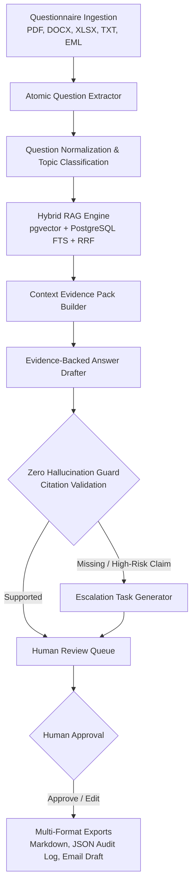

# EvidenceGuard — AI Security Questionnaire Copilot

> **“Evidence-backed security answers, with human approval before sending.”**

[](https://opensource.org/licenses/MIT)
[](https://www.python.org/)
[](https://fastapi.tiangolo.com/)
[](https://langchain-ai.github.io/langgraph/)
[](https://github.com/pgvector/pgvector)

**EvidenceGuard** is an open-source, enterprise-grade AI security copilot designed for B2B SaaS companies, IT agencies, and technical service providers. It automates the extraction, evidence-retrieval, and drafting of security questionnaires, RFPs, vendor risk assessments, and compliance audits while strictly guaranteeing zero hallucinated claims through a Human-in-the-Loop approval workflow.

---

## 🎯 Target Audience & Primary Use Cases

EvidenceGuard is engineered specifically for B2B businesses that undergo rigorous third-party vendor risk assessments:

- **B2B SaaS Companies**: Accelerate enterprise sales cycles by completing 50+ question vendor security assessments in minutes instead of days.
- **IT Consultancies & Agencies**: Standardize security audit responses across client accounts with auditable evidence packs.
- **Managed Service Providers (MSPs)**: Centralize security policies,SOC 2 reports, ISO 27001 certifications, and data residency blueprints into a searchable knowledge engine.
- **Security & Compliance Teams (CISO, GRC Officers)**: Eliminate risk of false compliance claims with mandatory human review before sending.

---

## 🔒 Core System Principle

```
No Approved Evidence  ➔  No Affirmative Claim  ➔  NEEDS_HUMAN_INPUT Flag
```

Unlike generic chatbots or unconstrained LLMs, EvidenceGuard **never fabricates certificates, encryption standards, SLAs, or compliance claims**. If a required evidence document is missing from your Knowledge Base, the system automatically flags the item as `NEEDS_HUMAN_INPUT` (`NO_EVIDENCE` / `HIGH_RISK_CLAIM`) and generates an escalation task for the owner team.

---

## 🛠️ Architecture & Workflow



---

## 🌟 Key Features

### 1. Multi-Format Ingestion
Parses pasted text or uploaded files including **PDF, DOCX, XLSX, TXT, CSV, and EML** emails, extracting atomic security requirements with original wording preserved.

### 2. Hybrid RAG Retrieval Engine
Combines **pgvector Cosine Similarity** (semantic search) with **PostgreSQL `tsvector` Full-Text Search** (keyword search). Uses **Reciprocal Rank Fusion (RRF)** and document **Trust Multipliers** (Policies: 1.2x, Certificates: 1.3x, Marketing: 0.0x) to surface exact evidence chunks.

### 3. LangGraph Stateful Workflow
Built on top of **LangGraph `StateGraph`** with an async execution pipeline and memory checkpointing (`MemorySaver`) for pause/resume capability.

### 4. Zero Hallucination Guard
Verifies every drafted answer against retrieved evidence chunks. Enforces strict citation requirements and flags unevidenced SOC 2 / ISO 27001 claims.

### 5. Interactive Human Review Queue UI
Server-rendered web interface (**Jinja2 + HTMX + Tailwind CSS**) allowing security officers to **Approve**, **Edit & Save**, **Escalate to Owner**, or **Reject** drafts.

### 6. Audit-Ready Exports
Export approved questionnaire responses into:
- **Markdown Security Response Document**
- **JSON Audit Trace** (full machine-readable evidence pack)
- **Client Email Summary Draft**

### 7. Dual Database Runtime (Zero-Setup Dev Mode)
- **Production**: Async PostgreSQL 17 with `pgvector` extension.
- **Local Dev Fallback**: Automatic, zero-setup fallback to SQLite (`aiosqlite`) when Docker/Postgres is offline.

### 8. Bilingual Support (EN & UK)
Full UI and export localization in both **English (`en`)** and **Ukrainian (`uk`)**.

---

## 💻 Tech Stack

| Layer | Technology / Library |
|---|---|
| **Core Framework** | Python 3.11+, FastAPI, Starlette |
| **Workflow Engine** | LangGraph (`StateGraph`, `MemorySaver`) |
| **Database & ORM** | SQLAlchemy 2.0 (Async), AsyncPG, `aiosqlite` |
| **Search & RAG** | `pgvector` (Cosine distance), PostgreSQL FTS (`tsvector`), RRF |
| **Frontend UI** | Server-Rendered Jinja2, HTMX 1.9+, Tailwind CSS |
| **Formatting & Linting** | Ruff, Pytest Asyncio, Alembic |

---

## 🚀 Quick Start Guide

### Prerequisites
- Python 3.11 or higher
- PowerShell / Terminal

### 1. Clone & Set Up Environment

```powershell
git clone https://github.com/your-username/evidenceguard.git
cd evidenceguard

# Create and activate virtual environment
python -m venv .venv
.\.venv\Scripts\Activate.ps1

# Install dependencies
pip install -e .
```

### 2. Run Local Development Server

```powershell
# Starts FastAPI server with auto-reload (uses SQLite fallback if Docker is offline)
uvicorn src.main:app --reload
```

Open your browser at:
👉 **[http://localhost:8000/](http://localhost:8000/)**

---

### 3. Seed Demo Data (Optional)

To instantly seed realistic security policies and sample questionnaires:

```powershell
$env:PYTHONPATH='.'
python scripts/seed_demo.py
python scripts/index_demo_files.py
```

Now explore pre-loaded documents at `http://localhost:8000/ui/documents` and test review at `http://localhost:8000/ui/review`.

---

### 4. Running with Docker Compose (PostgreSQL 17 + pgvector)

```bash
docker compose up -d --build
```

---

## 🧪 Running Unit & Integration Tests

```powershell
.\.venv\Scripts\pytest.exe
.\.venv\Scripts\ruff.exe check .
```

---

## 📂 Project Structure

```
evidenceguard/
├── docs/                        # Product spec, MVP scope, Architecture diagrams
├── demo_files/                  # Sample test policies and questionnaires
├── scripts/                     # Seed scripts & diagnostic utilities
├── src/
│   ├── api/routes/              # FastAPI endpoints (documents, questionnaires, review, exports)
│   ├── database/                # SQLAlchemy 2.0 models, sessions, fixtures
│   ├── rag/                     # Parser, chunking, embeddings, Hybrid RAG retriever
│   ├── workflow/                # LangGraph state, nodes, graph compilation, LLM mock
│   ├── templates/               # Jinja2 HTML templates for UI
│   ├── config.py                # Pydantic Settings
│   ├── i18n.py                  # Bilingual (EN/UK) dictionary
│   ├── ui_templates.py          # Shared Jinja2 instance
│   └── main.py                  # FastAPI application entry point
├── tests/                       # Pytest test suite (15/15 passing)
├── Dockerfile                   # Production Containerfile
├── docker-compose.yml           # App + PostgreSQL 17 + pgvector
├── pyproject.toml               # Package dependencies & configs
└── LICENSE                      # MIT Open Source License
```

---

## 📄 License & Attribution

This project is licensed under the **MIT License with Attribution**. 

Copyright (c) 2026 **Ivan Sokol**.

Any use, distribution, or modification of this project requires preserving the author's copyright notice and providing visible attribution links to:
- **GitHub:** [IvanSokol82](https://github.com/IvanSokol82)
- **LinkedIn:** [Ivan Sokol](https://www.linkedin.com/in/ivan-sokol-automation/)

See the [`LICENSE`](file:///c:/OSPanel/home/lenggraf/LICENSE) file for full license text details.
